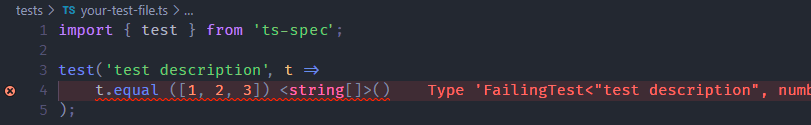
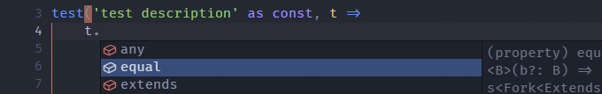

# ts-spec

A small library for testing your types.

Features:
- Prevent false negatives and silent regressions;
- Organise you tests and declutter your namespace.
- Compare types and values with the same API;

## How to install
```
npm install --save-dev ts-spec
```

## How to use
Write your tests:
```typescript
import { test } from 'ts-spec';

test('test description' as const, t => 
    t.equal ([1, 2, 3]) <string[]>()
);
```
See them fail in your IDE:




Or run them with `tsc`:
```
tests/your-test-file.ts:4:5 - error TS2322:

Type 'FailingTest<"test description", number[], string[]>'
is not assignable to type 'PassingTest | PassingTest[]'

t.equal ([1, 2, 3], <string[]>_)
        ~~~~~~~~~~~~~~~~~~~~~~~

Found 1 error.
```

## Limitation

The only way to expect a type error is with the directive `@ts-expect-error`.

Test descriptions must appear on the same line as the directive for them to show up in the report:

```typescript
// @ts-expect-error: `foo` does not accept strings
{ const test = foo('bar') }
```
```
tests/your-test-file.ts:3:1 - error TS2578: Unused '@ts-expect-error' directive.        

// @ts-expect-error: `foo` does not accept strings
   ~~~~~~~~~~~~~~~~~~~~~~~~~~~~~~~~~~~~~~~~~~~~~~~
```

> Note that they won't appear in VS Code's Problems view

The downside of expecting errors is that they can have other reasons to occur than the one stated in the description. For example, it could be that `foo` actually accepts strings but is not in scope.

# Documentation

[Writing tests](#writing-tests) | [Assertions](#assertions) | [Equality](#equality)

## Writing tests
### `debug`

The function `debug` has the same functionality as `test` but doesn't accept a test description.

### `test`

The function `test` is composed of a test description and a callback.

The test description must use a [const assertion](https://www.typescriptlang.org/docs/handbook/release-notes/typescript-3-4.html#const-assertions).

```typescript
test('test description' as const, ...);
//                      --------
```

 You will see the following error if you forget it:

```
Argument of type 'string' is not assignable to parameter of type '{ [missing]: "as const"; }
```

The callback can return an assertion, an assertion returning function, or an array of either of them.

#### Single assertion

```ts
test('foo is Foo' as const, t =>
    t.equal (foo) <Foo>()
);
```

#### Array of assertions
The recommended way to do it is the following:
```typescript
test('`factory` returns the right instance' as const, t => [
    t.equal (factory('foo')) <Foo>(),
    t.equal (factory('bar')) <Bar>()
]);
```
The following, although equivalent, prints noisier error messages
```typescript
test('`factory` returns the right instance' as const, t => {
    return [
        t.equal (factory('foo')) <Foo>(),
        t.equal (factory('bar')) <Bar>()
    ]
});
```

#### Assertion returning function
This pattern can be useful for testing type narrowing with only little boilerplate
```typescript
test('`includedIn` narrows down its input' as const, t =>
    input => includedIn(input, [1, 2, 3]) && t.equal(input, <number>_)
);
```
or for scoping test variables
```typescript
test('`factory` returns the right instance' as const, t => [
    () => {
        const foo = factory('foo');
        return t.equal (foo) <Foo>()
    },
    () => {
        const bar = factory('bar');
        return t.equal (bar) <Bar>()
    }
]);
```

## Assertions 

The library supports the following assertions
<table>
<tr>
<th align='center' width='130'>
<th align='center'>


```ts
t.assertion()
```
</th>
<th align='center'>


```ts
t.not.assertion()
```

</th>
<tr><td>equal A B
<td><ul><li>A and B are <a href="#equality">disambiguated</a><li>A and B extend each other
<td><ul><li>A and B are disambiguated<li>A and B do <strong>not</strong> extend each other

<tr><td>extends A B
<td><ul><li>A is disambiguated<li>A extends B
<td><ul><li>A is disambiguated<li>A does <strong>not</strong> extend B


<tr><td>includes A B
<td><ul><li>B is disambiguated<li>B extends A
<td><ul><li>B is disambiguated<li>B does <strong>not</strong> extend A


<tr><td>
any T
<td>&nbsp;&nbsp;&nbsp;T is strictly <code>any</code>
<td>&nbsp;&nbsp;&nbsp;T is strictly <strong>not</strong> <code>any</code>

<tr><td>unknown T
<td>&nbsp;&nbsp;&nbsp;T is strictly <code>unknown</code>
<td>&nbsp;&nbsp;&nbsp;T is strictly <strong>not</strong> <code>unknown</code>

<tr><td>never T
<td>&nbsp;&nbsp;&nbsp;T is strictly <code>never</code>
<td>&nbsp;&nbsp;&nbsp;T is strictly <strong>not</strong> <code>never</code>

<tr><td>true T
<td>&nbsp;&nbsp;&nbsp;T is strictly <code>true</code>
<td>&nbsp;&nbsp;&nbsp;T is strictly <strong>not</strong> <code>true</code>

<tr><td>false T
<td>&nbsp;&nbsp;&nbsp;T is strictly <code>false</code>
<td>&nbsp;&nbsp;&nbsp;T is strictly <strong>not</strong> <code>false</code>

</table>


They are made available as an argument in `test`'s callback.



They can be called in different ways depending on whether you test values (`a`) or types (`A`)\
and whether you prefer the placeholder or the curried syntax:

<table>
<tr>
<th align="center" width='190'>types only</th>
<th>


```typescript
import { _ } from 'ts-spec'
```
</th>
<th align="center">curried syntax</th>
</tr>
<tr>
<td>

```typescript
t.equal<A, B>()
```

</td>
<td>

```typescript
t.equal(a, b)

t.equal(a, <B>_)

t.equal(<A>_, b)

t.equal(<A>_, <B>_)
```

</td>
<td>

```typescript
t.equal (a) (b)

t.equal (a) <B>()

t.equal <A>() (b)

t.equal <A>() <B>()
```

</td>
</tr>
</table>

### Custom assertions

You can leverage currying to create your own assertions:

```typescript
test('Bar and Baz are Foo' as const, t => {
    const isFoo = t.equal<Foo>();
    return [
        isFoo<Bar>(),
        isFoo<Baz>()
    ];
})
```

If you want to share a custom assertion across tests, you must bring `Context` into scope and connect it like so:

```typescript
import { Context } from 'ts-spec';

const isFoo = <D>(t: Context<D>) => t.equal<Foo>();
```
Then, on the call site, apply the assertion with the context object before use:
```typescript
test('Bar is Foo' as const, t =>
    isFoo(t)<Bar>()
)
```

## Equality

Tests can fail for 2 reasons:
- The condition of the assertion did not hold;
- `any`, `never` or `unknown` accidentally appeared in your type. 

A process of disambiguation converts `any`, `never` and `unknown` to unique symbols. The resulting behaviour is what you would expect from strict equality:

```typescript
test('`any` is equal to itself' as const, t =>
    t.equal<{ foo: Set<any> }, { foo: Set<any> }>()
)

test('`any` is not equal to `number`' as const, t =>
    t.equal<{ foo: Set<any> }, { foo: Set<number> }>()
//  ~~~~~~~~~~~~~~~~~~~~~~~~~~~~~~~~~~~~~~~~~~~~~~~~~~ FailingTest
)

```

### Asymmetric equality

Assertions are set up with the assumption that the type under test should always be the narrowest of the two operands, the other one is thus not disambiguated in order to enable loose tests to be written:

```typescript
test('It is possible to extend `any`' as const, t => [
    t.extends<number[], any[]>()
    t.includes<any[], number[]>()
])

test('But the reverse is likely a mistake' as const, t => [
    t.extends<any[], number[]>()
//  ~~~~~~~~~~~~~~~~~~~~~~~~~~~~ FailingTest
    t.includes<number[], any[]>()
//  ~~~~~~~~~~~~~~~~~~~~~~~~~~~~ FailingTest
])
```
You can refer to the [assertions table](#assertions) for a synthetic view of the differences between assertions.

#### Placeholders
If you want the type under test to include `any`, `never` or `unknown` in an asymmetric assertion, you can import the placeholders `_any`, `_never` and `_unknown`:

```typescript
import { _never } from 'ts-spec'

test('use `_never` to extend `never`' as const, t => [
    t.extends<[1, 2, never], [number, number, _never]>(),
])
```

### User classes
Disambiguation works out of the box for arbitrarily nested built-in types. However, user classes need to be registered for them to be disambiguated:
```typescript
import { test } from 'ts-spec'
import { Type, A } from 'free-types'

// The class we want to test
class Foo<T extends number> {
    constructor(private value: T) { ... }
}

// A free type constructor for that class
interface $Foo extends Type<[number]> { type: Foo<A<this>> }

// which we register into ts-spec.TypesMap
declare module 'ts-spec' {
    interface TypesMap { Foo: $Foo }
}

// Now we are safe
test('Registered user classes are disambiguated' as const, t =>
    t.equal<Foo<any>, Foo<number>>()
//  ~~~~~~~~~~~~~~~~~~~~~~~~~~~~~~~~ FailingTest
)
```

> The `TypesMap` repository is shared with the `free-types` library, which means `declare module 'free-types'` would also work.

See the [free-types](https://github.com/geoffreytools/free-types) documentation for more information about free type constructors.